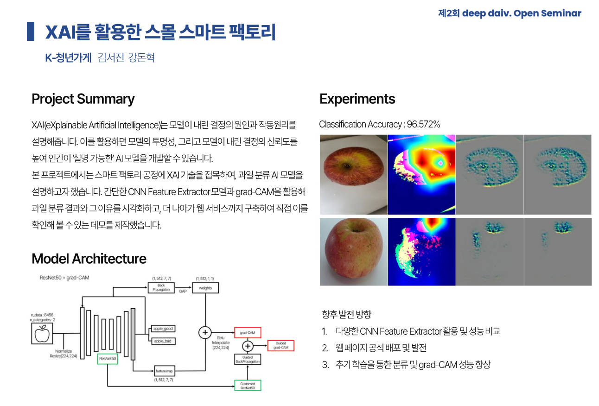
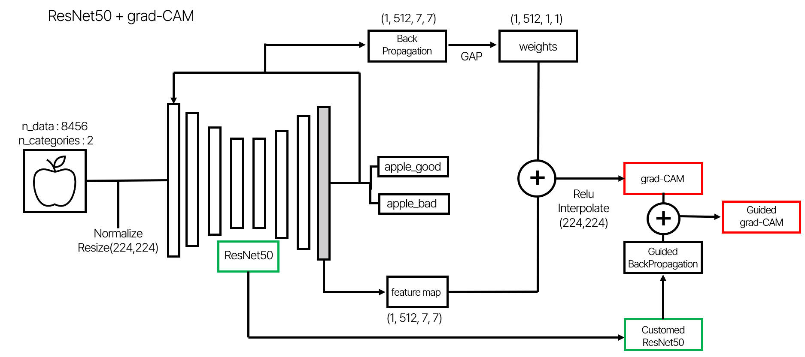
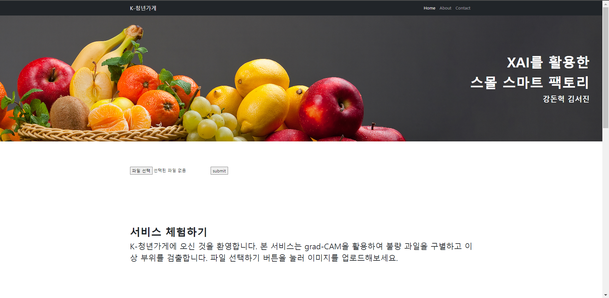
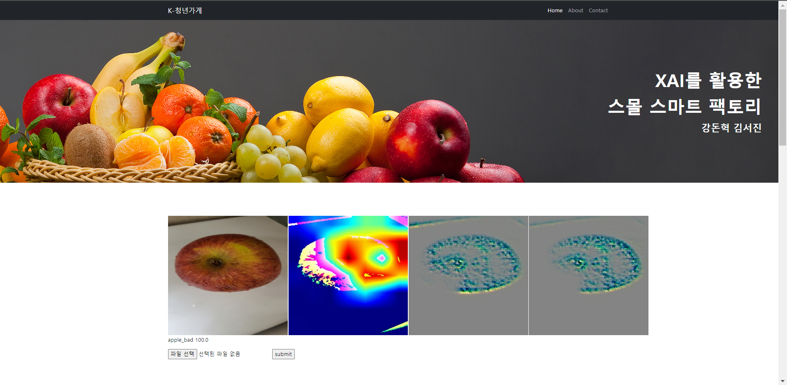

# XAI를 활용한 스몰 스마트 팩토리

## 프로젝트 소개

XAI는 **eXplainable Artificial Intelligence**의 줄임말로, 설명가능한 AI를 뜻한다. 현재 딥러닝은 기술이 과학보다 앞서 활용되고 있는 상태이다. 예를 들어, 열역학 법칙이 정립되기도 전에도 이미 증기기관차는 달리고 있었던 것처럼 말이다. 

사람이 처음부터 끝까지 원리를 이해하며 만드는 기존 프로그래밍과 다르게, 딥러닝은 수많은 층에서 일어나는 가중치와 편향들의 조정이 정확히 어떤 영향을 일으키는지 알 수 없다. 이러한 이유로 AI 모델은 **블랙박스**라고도 불린다. XAI 기술은 모델이 어떠한 결론을 내린 이유와 과정을 시각화해서, AI 내부의 작동 원리를 쉽게 파악할 수 있게 해준다.

본 프로젝트에서는 이 기술을 스마트 팩토리 공정에 활용해보기로 결정했다. 제조, 또는 분류 공정에서 XAI를 활용하면 모델의 투명성, 더 나아가 출력 결과와 스마트 팩토리의 공정 자체에 대한 신뢰도를 높혀줄 수 있을 것이라 생각했다.

**모델 및 프로젝트 내용 정리** : [Notion]

## 프로젝트 데모

   
  
   

 

## 구현 기능

### DL Model

   
  
   

### Web

   
  
   

   
  
   

### Server

AWS ec2 + PuTTY + FileZilla

 

## 라이센스

MIT &copy;

<!-- Refernces -->

[Notion]: https://deepdaiv.notion.site/XAI-b4cffad4091f400ea5b8bd3462bd79c8
